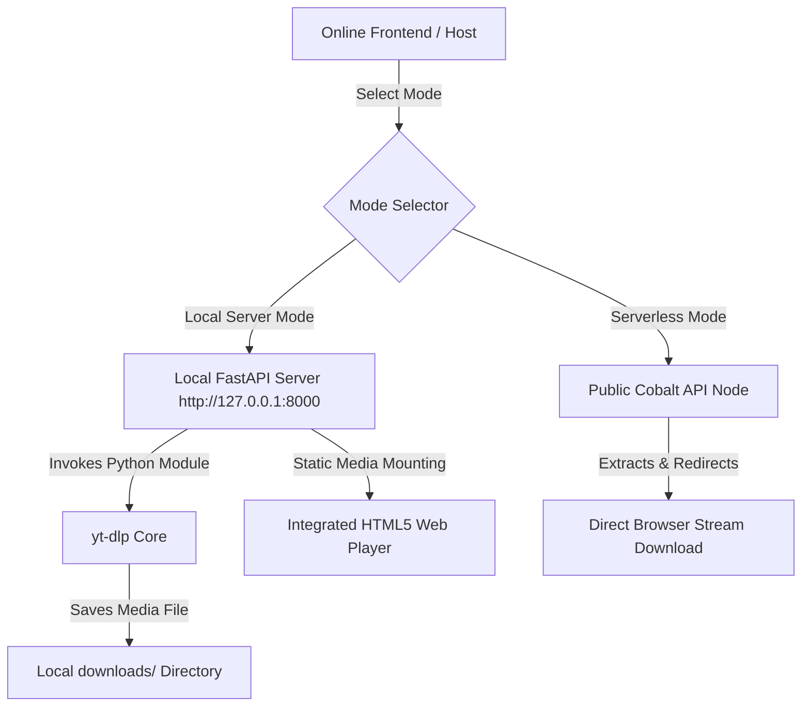

# 📟 LENLU DLP — Retro Terminal Media Web GUI

> A premium, high-fidelity retro terminal interface for media downloading, supporting hybrid local hosting and serverless operations.

---

```
██╗     ███████╗███╗   ██╗██╗     ██╗   ██╗    ██████╗ ██╗     ██████╗ 
██║     ██╔════╝████╗  ██║██║     ██║   ██║    ██╔══██╗██║     ██╔══██╗
██║     █████╗  ██╔██╗ ██║██║     ██║   ██║    ██║  ██║██║     ██████╔╝
██║     ██╔══╝  ██║╚██╗██║██║     ██║   ██║    ██║  ██║██║     ██╔═══╝ 
███████╗███████╗██║ ╚████║███████╗╚██████╔╝    ██████╔╝███████╗██║     
╚══════╝╚══════╝╚═╝  ╚═══╝╚══════╝ ╚═════╝     ╚═════╝ ╚══════╝╚═╝     
```

---

## ⚡ Highlights

* **📟 Immersive Retro Aesthetic**: Sleek monospace terminal design styled with custom color schemes (Modern Dark, Classic Green, PowerShell Blue, Ubuntu Purple).
* **🔄 Dual-Engine Architecture**: 
  * **Local Server Engine**: Powered by Python's **FastAPI** + **yt-dlp** for direct local filesystem downloads, high-res merging (with ffmpeg), speed-limiting, and an integrated local media player.
  * **Serverless Engine**: Powered by public **Cobalt API** nodes for lightweight direct-to-browser downloading without needing python setup.
* **🌐 Deploy Anywhere**: Deploy the static frontend on Vercel or GitHub Pages, and securely link to your local server backend (`127.0.0.1`) without secure context limitations.
* **🔧 Advanced Controller System**:
  * Real-time download progress and speed limits.
  * Integrated interactive command-line console emulator.
  * Extensible stream format matrix with size, codec, and fps filters.

---

## 📐 System Architecture



---

## 🛠️ Get Started (Local Server Mode)

### Prerequisites

* Python 3.10+
* ffmpeg (Recommended, for automatic audio/video format merging)

### Installation

1. Clone or download this project:
   ```bash
   git clone <repository_url>
   cd "lenlu dlp"
   ```

2. Install dependencies:
   ```bash
   pip install fastapi uvicorn yt-dlp
   ```

3. Run the GUI startup server script (launches `http://127.0.0.1:8000/app` automatically):
   ```bash
   python run_gui.py
   ```

> [!NOTE]
> On Windows, you can double-click or execute using the launcher command:
> `py run_gui.py`

---

## 🌐 Deploying Frontend Online (Vercel / GitHub Pages)

The repository contains two main static pages:
- **Landing Page ([index.html](file:///c:/Users/arune/OneDrive/Documents/github_f/lenlu%20dlp/index.html))**: Served at the root `/` path. Features highlights, instructions, and an interactive embedded preview of the app client.
- **Web App Client ([local_host.html](file:///c:/Users/arune/OneDrive/Documents/github_f/lenlu%20dlp/local_host.html))**: Served at `/local_host.html` or `/app`. This is the fully-featured graphical downloader GUI.

To host the site online while retaining connection to your local backend machine:

1. **Deploy the Static Folder**: Use Vercel to host the repository root:
   ```bash
   vercel .
   ```
2. **Configure Custom Startup Deployed URL**:
   * Open the app settings (Tab 5) on the web app (`/local_host.html`).
   * Add your custom online URL (e.g. `https://lenlu-dlp.vercel.app/local_host.html`) to the **DEPLOYED_FRONTEND_URL** setting and click commit.
   * Now, starting `run_gui.py` locally will automatically open your online app client in the web browser instead of localhost.

> [!IMPORTANT]
> **Browser Security Exemptions:**
> Modern browsers block secure sites (`https://`) from requesting non-secure HTTP APIs (`http://`). However, the browser treats `http://127.0.0.1` and `http://localhost` as **secure secure-origins**. Always ensure your **LOCAL_SERVER_URL** is set to `http://127.0.0.1:8000` inside the connection popup.

---

## ⚙️ Configuration Parameters

| Parameter | Type | Description |
| :--- | :--- | :--- |
| `downloads_dir` | Path | Absolute folder path on your computer where downloaded files are saved. |
| `open_browser` | Boolean | Toggles launching the default browser on server startup. |
| `deployed_frontend_url` | URL | Points local server launcher to your custom hosted website link. |
| `theme` | Select | Sets active visual terminal style (`dark`, `green`, `powershell`, `ubuntu`). |
| `cobalt_url` | URL | Public endpoint utilized in Serverless Mode (default: `https://api.cobalt.cafe`). |

---

## 💎 Custom Keyboard Commands (CLI Console)

Type these commands directly inside the footer console prompt on the website and hit **ENTER**:

* `status` - Retrieve connection status and process details.
* `clear` - Clear console feed buffer.
* `library` - View and refresh local downloads library catalog.
* `select-folder` - Open OS folder picker dialog to change target download directory.
* `help formats` - Show quick matrix guide.
* `site-folder` - Set target downloads directory to fallback project downloads preset.
